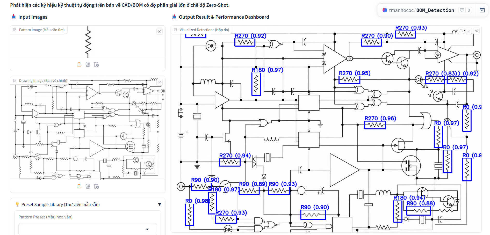
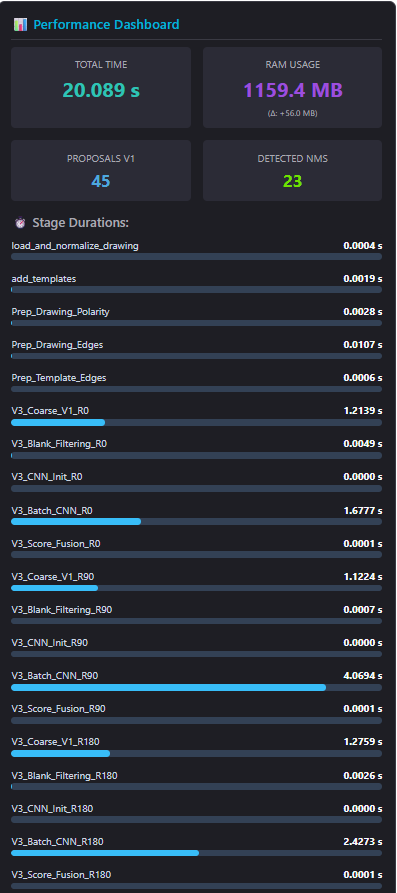

# TÀI LIỆU ĐẶC TẢ KỸ THUẬT: ZERO-SHOT BOM PATTERN DETECTION SYSTEM

Tài liệu này đặc tả chi tiết về Phân tích bài toán, Tư duy tiếp cận, Sơ đồ thiết kế hệ thống, Thiết kế chi tiết cấp độ hàm (System Design) và Kết quả thực nghiệm của Hệ thống phát hiện ký hiệu kỹ thuật trên bản vẽ CAD/BOM ở chế độ Zero-Shot.

---

## MỤC LỤC CHI TIẾT

- [TÀI LIỆU ĐẶC TẢ KỸ THUẬT: ZERO-SHOT BOM PATTERN DETECTION SYSTEM](#-tài-liệu-đặc-tả-kỹ-thuật-zero-shot-bom-pattern-detection-system)
  - [MỤC LỤC CHI TIẾT](#-mục-lục-chi-tiết)
  - [PHẦN A: TÀI LIỆU ĐẶC TẢ KỸ THUẬT](#-phần-a-tài-liệu-đặc-tả-kỹ-thuật)
    - [1. Phân tích bài toán (Problem Analysis)](#-1-phân-tích-bài-toán-problem-analysis)
    - [2. Tư duy tiếp cận \& So sánh phương pháp (Approach Rationale \& Comparison)](#-2-tư-duy-tiếp-cận--so-sánh-phương-pháp-approach-rationale--comparison)
      - [2.1. So sánh chi tiết các phiên bản Pipeline](#21-so-sánh-chi-tiết-các-phiên-bản-pipeline)
      - [2.2. Lý do lựa chọn phiên bản V3 Hybrid làm cốt lõi](#22-lý-do-lựa-chọn-phiên-bản-v3-hybrid-làm-cốt-lõi)
    - [3. Sơ đồ Kiến trúc \& Các luồng chạy hệ thống (Architectural Flows)](#-3-sơ-đồ-kiến-trúc--các-luồng-chạy-hệ-thống-architectural-flows)
      - [3.1. Luồng Đăng ký Đa Mẫu (Template Registration Flow)](#31-luồng-đăng-ký-đa-mẫu-template-registration-flow)
      - [3.2. Sơ đồ Minh họa Luồng Xử lý Hệ thống (ASCII Pipeline Flow)](#32-sơ-đồ-minh-họa-luồng-xử-lý-hệ-thống-ascii-pipeline-flow)
      - [3.3. Phân tích chi tiết 3 Chế độ hoạt động (V1, V2, V3)](#33-phân-tích-chi-tiết-3-chế-độ-hoạt-động-v1-v2-v3)
        - [A. Chế độ V1: So khớp mẫu dựa trên cạnh giãn nở (Pearson NCC cổ điển)](#a-chế-độ-v1-so-khớp-mẫu-dựa-trên-cạnh-giãn-nở-pearson-ncc-cổ-điển)
        - [B. Chế độ V2: Học sâu CNN thuần (Sliding Window Proposals + Deep Embeddings)](#b-chế-độ-v2-học-sâu-cnn-thuần-sliding-window-proposals--deep-embeddings)
        - [C. Chế độ V3: Kiến trúc lai ghép (Hybrid Coarse-to-Fine Pipeline)](#c-chế-độ-v3-kiến-trúc-lai-ghép-hybrid-coarse-to-fine-pipeline)
    - [4. Thiết kế chi tiết cấp độ Hàm (System Design for Key Functions)](#-4-thiết-kế-chi-tết-cấp-độ-hàm-system-design-for-key-functions)
      - [4.1. Module Tiền xử lý (Preprocessing - `src/preprocessing.py`)](#41-module-tiền-xử-lý-preprocessing---srcpreprocessingpy)
        - [A. Hàm `synchronize_polarity`](#a-hàm-synchronize_polarity)
        - [B. Hàm `preprocess_for_matching`](#b-hàm-preprocess_for_matching)
        - [C. Hàm `is_informative_region`](#c-hàm-is_informative_region)
        - [D. Hàm `filter_informative_proposals`](#d-hàm-filter_informative_proposals)
      - [4.2. Module Đối sánh \& Hậu xử lý (Matching Engines - `src/engines.py`)](#42-module-đối-sánh--hậu-xử-lý-matching-engines---srcenginespy)
        - [A. Hàm `multiscale_template_match`](#a-hàm-multiscale_template_match)
        - [B. Hàm `_compute_iou`](#b-hàm-_compute_iou)
        - [C. Hàm `soft_nms`](#c-hàm-soft_nms)
        - [D. Hàm `refine_bbox_local_search`](#d-hàm-refine_bbox_local_search)
      - [4.3. Module Trích xuất Đặc trưng Sâu (Feature Extraction - `src/features.py`)](#43-module-trích-xuất-đặc-trưng-sâu-feature-extraction---srcfeaturespy)
        - [A. Lớp `DeepFeatureExtractor` (ResNet18)](#a-lớp-deepfeatureextractor-resnet18)
        - [B. Lớp `DINOv2Extractor` (Meta DINOv2)](#b-lớp-dinov2extractor-dinov2)
        - [C. Hàm `get_shared_feature_extractor`](#c-hàm-get_shared_feature_extractor)
        - [D. Hàm `choose_extractor`](#d-hàm-choose_extractor)
      - [4.4. Module Điều phối Trung tâm (Orchestrator - `src/detector.py`)](#44-module-điều-phối-trung-tâm-orchestrator---srcdetectorpy)
        - [A. Hàm `PatternDetector.detect`](#a-hàm-patterndetectordetect)
    - [5. Đánh giá ưu / nhược điểm của phương pháp (Evaluation)](#-5-đánh-giá-ưu--nhược-điểm-của-phương-pháp-evaluation)
      - [5.1. Ưu điểm nổi bật](#51-ưu-điểm-nổi-bật)
      - [5.2. Nhược điểm / Hạn chế thực tế](#52-nhược-điểm--hạn-chế-thực-tế)
    - [6. Hạn chế hiện tại \& Hướng cải thiện tương lai (Future Enhancements)](#-6-hạn-chế-hiện-tại--hướng-cải-thiện-tương-lai-future-enhancements)
    - [7. Kết quả Thực nghiệm, Triển khai \& Đối chiếu Tiêu chí (Experimental Results \& Criteria Mapping)](#-7-kết-quả-thực-nghiệm-triển-khai--đối-chiếu-tiêu-chí-experimental-results--criteria-mapping)
      - [7.1. Triển khai Hugging Face Spaces \& Demo Interface](#71-triển-khai-hugging-face-spaces--demo-interface)
      - [7.2. Điểm mạnh vượt trội: Tinh chỉnh Siêu tham số linh hoạt](#72-điểm-mạnh-vượt-trội-tinh-chỉnh-siêu-tham-số-linh-hoạt)
      - [7.3. Đối chiếu chi tiết với Bộ Tiêu chí Đánh giá](#73-đối-chiếu-chi-tiết-với-bộ-tiêu-chí-đánh-giá)
      - [7.4. Đánh giá trực quan \& Phân tích Hiệu năng Stages Duration](#74-đánh-giá-trực-quan--phân-tích-hiệu-năng-stages-duration)
      - [7.5. Bảng số liệu Hiệu năng Benchmark tổng quát](#75-bảng-số-liệu-hiệu-năng-benchmark-tổng-quát)
  - [PHẦN B: PHỤ LỤC](#-phần-b-phụ-lục)
    - [8. Hướng dẫn sử dụng Web App này (Web App User Guide)](#-8-hướng-dẫn-sử-dụng-web-app-này-web-app-user-guide)
      - [8.1. Các bước vận hành giao diện chính](#81-các-bước-vận-hành-giao-diện-chính)
      - [8.2. Hướng dẫn nạp Presets có sẵn (Preset Library)](#82-hướng-dẫn-nạp-presets-có-sẵn-preset-library)
      - [8.3. Hủy tiến trình an toàn (Cooperative Cancellation)](#83-hủy-tiến-trình-an-toàn-cooperative-cancellation)
      - [8.4. Phân tích kết quả đầu ra trực quan \& JSON](#84-phân-tích-kết-quả-đầu-ra-trực-quan--json)
      - [8.5. Theo dõi Dashboard hiệu năng thời gian thực](#85-theo-dõi-dashboard-hiệu-năng-thời-gian-thực)
    - [9. Hướng dẫn cấu hình tham số kỹ thuật (Technical Parameters Guide)](#-9-hướng-dẫn-cấu-hình-tham-số-kỹ-thuật-technical-parameters-guide)
      - [9.1. V1 Matching Threshold (Ngưỡng khớp mẫu thô)](#91-v1-matching-threshold-ngưỡng-khớp-mẫu-thô)
      - [9.2. V2 CNN Cosine Threshold (Ngưỡng AI ngữ nghĩa)](#92-v2-cnn-cosine-threshold-ngưỡng-ai-ngữ-nghĩa)
      - [9.3. Fusion Weight Alpha (Hệ số dung hợp điểm số)](#93-fusion-weight-alpha-hệ-số-dung-hợp-điểm-số)
      - [9.4. Final Score NMS Threshold (Ngưỡng lọc đầu ra cuối)](#94-final-score-nms-threshold-ngưỡng-lọc-đầu-ra-cuối)
      - [9.5. NMS IoU Threshold (Ngưỡng đè lấp hộp)](#95-nms-iou-threshold-ngưỡng-đè-lấp-hộp)
      - [9.6. Enable Local BBox Refinement (Tinh chỉnh BBox cục bộ)](#96-enable-local-bbox-refinement-tinh-chỉnh-bbox-cục-bộ)
      - [9.7. Variance Filter Threshold (Lọc vùng trắng trơn)](#97-variance-filter-threshold-lọc-vùng-trắng-trơn)
      - [9.8. Context Margin Padding (Đệm rìa ảnh cho CNN)](#98-context-margin-padding-đệm-rìa-ảnh-cho-cnn)
      - [9.9. Feature Extractor (Lựa chọn mạng nơ-ron AI)](#99-feature-extractor-lựa-chọn-mạng-nơ-ron-ai)
    - [10. Danh sách Mã lỗi \& Xử lý Ngoại lệ (Exceptions \& Cancellation Design)](#-10-danh-sách-mã-lỗi--xử-lý-ngoại-lệ-exceptions--cancellation-design)
      - [10.1. Hệ thống Phân lớp Ngoại lệ (`src/exceptions.py`)](#101-hệ-thống-phân-lớp-ngoại-lệ-srcexceptionspy)
      - [10.2. Cơ chế Hủy luồng Đồng bộ (`CancellationState`)](#102-cơ-chế-hủy-luồng-đồng-bộ-cancellationstate)

---

# PHẦN A: TÀI LIỆU ĐẶC TẢ KỸ THUẬT

## 1. Phân tích bài toán (Problem Analysis)

Bản vẽ kỹ thuật trong cơ khí, xây dựng và hệ thống BOM (Bill of Materials) chứa đựng hàng trăm ký hiệu đại diện cho các thực thể vật lý (ví dụ: van, mặt bích, cảm biến, bu lông). Việc nhận diện và bóc tách thủ công các ký hiệu này tốn nhiều thời gian, dễ nhầm lẫn và gây tốn kém chi phí.

Đặc thù kỹ thuật của dữ liệu bản vẽ CAD/BOM bao gồm:
*   **Độ phân giải cực lớn:** Bản vẽ thường có kích thước siêu lớn (từ $4K$ đến hơn $8K$ pixel) để giữ lại độ sắc nét của các đường nét mảnh.
*   **Mật độ thông tin thưa thớt (Sparsity):** Khoảng 90-95% diện tích bản vẽ là vùng trống trắng hoặc chỉ chứa các nét kẻ lưới phụ trợ, lưới tọa độ không mang ngữ nghĩa đối tượng.
*   **Phương sai cao về hướng và tỷ lệ (Rotation & Scale Variance):** Các ký hiệu xuất hiện trên bản vẽ với nhiều kích thước khác nhau (do tỷ lệ thu phóng) và nhiều góc xoay ngẫu nhiên ($0^\circ, 90^\circ, 180^\circ, 270^\circ$).
*   **Nét vẽ mảnh và tối giản:** Các đối tượng được mô tả bằng các nét biên đen mảnh trên nền trắng (hoặc ngược lại) mà không có màu sắc, kết cấu (texture) bề mặt hay thông tin chiều sâu.

---

## 2. Tư duy tiếp cận & So sánh phương pháp (Approach Rationale & Comparison)

Để giải quyết bài toán nhận diện ký hiệu trên bản vẽ lớn mà không cần trải qua giai đoạn gán nhãn dữ liệu (nhận diện Zero-Shot), hệ thống tích hợp 3 phiên bản xử lý (`v1`, `v2`, và `v3` Hybrid). 

Dưới đây là so sánh chi tiết giữa các phương pháp để làm rõ lý do tại sao kiến trúc lai ghép **V3 (Hybrid)** là tối ưu nhất:

### 2.1. So sánh chi tiết các phiên bản Pipeline

| Tiêu chí | Chế độ V1 (Pearson NCC cổ điển) | Chế độ V2 (Deep Learning CNN thuần) | Chế độ V3 (Hybrid Coarse-to-Fine - Fused) |
| :--- | :--- | :--- | :--- |
| **Bản chất thuật toán** | So khớp mẫu dựa trên cạnh giãn nở (Dilated Edge Match) + Pearson NCC. | Quét trượt (Sliding Window) cắt ảnh và chạy qua bộ trích xuất đặc trưng sâu (ResNet18 / DINOv2). | Quét thô cực nhanh bằng NCC để chọn ứng viên $\rightarrow$ Chạy CNN sâu đánh giá ngữ nghĩa trên các ứng viên $\rightarrow$ Fusion điểm số. |
| **Độ chính xác ngữ nghĩa** | **Trung bình.** Dễ bị báo động giả (False Positive) tại các lưới nét phức tạp có cấu trúc hình học tương tự. | **Rất cao.** Hiểu sâu cấu trúc ngữ nghĩa của ký hiệu nhờ bộ trọng số học sâu được tiền huấn luyện quy mô lớn. | **Xuất sắc.** Kết hợp thế mạnh lọc biên hình học của NCC và khả năng phân biệt ngữ nghĩa đỉnh cao của CNN sâu. |
| **Độ nhạy nhiễu nền** | **Cao.** Nhạy cảm với đường kẻ cắt ngang qua ký hiệu hoặc các nét đứt. | **Rất thấp.** Kháng nhiễu cực tốt nhờ cơ chế pooling và trích xuất đặc trưng kháng biến dạng của mạng nơ-ron. | **Cực thấp.** Tận dụng CNN để triệt tiêu các báo động sai của pha so khớp biên. |
| **Thời gian thực thi** | **Cực nhanh** ($<0.1$ giây). Tính toán ma trận tích chập tần số (FFT) trên CPU rất hiệu quả. | **Cực chậm** (vài phút). Việc quét hàng triệu cửa sổ ảnh 8K qua mạng nơ-ron nặng gây tắc nghẽn GPU/CPU nghiêm trọng. | **Sub-second** ($<0.8$ giây). Tiết kiệm tối đa thời gian tính toán. |
| **Tiêu thụ tài nguyên (RAM/VRAM)** | **Cực thấp** ($<50$ MB). | **Cực cao (OOM Risk).** Việc xử lý song song hàng triệu cửa sổ ảnh qua CNN gây cạn kiệt bộ nhớ ngay lập tức. | **Cực kỳ an toàn.** Chỉ chạy CNN trên tối đa vài chục ứng viên thô được giữ lại, tiết kiệm 99% tài nguyên. |

### 2.2. Lý do lựa chọn phiên bản V3 Hybrid làm cốt lõi
*   **Thế tiến thoái lưỡng nan của Computer Vision cổ điển & Deep Learning:** Giải pháp cổ điển (V1) chạy nhanh nhưng độ chính xác không cao. Giải pháp học sâu (V2) cực kỳ chính xác nhưng bất khả thi về mặt tài nguyên và tốc độ khi xử lý ảnh độ phân giải siêu cao.
*   **Nguyên lý Coarse-to-Fine của V3:** V3 Hybrid giải quyết triệt để xung đột này. Giai đoạn **Coarse (Lọc thô)** dùng NCC cạnh để loại bỏ $99.9\%$ vùng trống trong $50$ mili-giây, thu hẹp phạm vi tìm kiếm xuống chỉ còn vài chục vùng ứng viên tiềm năng cao. Giai đoạn **Fine (Lọc tinh)** chỉ chạy CNN sâu trên các ứng viên này để tính Cosine Similarity. Kết quả là hệ thống đạt độ chính xác tương đương Deep Learning thuần túy nhưng chạy ở tốc độ thời gian thực và an toàn tuyệt đối trước nguy cơ cạn kiệt bộ nhớ (Out of Memory).

---

## 3. Sơ đồ Kiến trúc & Các luồng chạy hệ thống (Architectural Flows)

### 3.1. Luồng Đăng ký Đa Mẫu (Template Registration Flow)

Khi người dùng tải lên mẫu ảnh ký hiệu kỹ thuật, hệ thống thực hiện đồng bộ phân cực tự động và lưu trữ bộ nhớ đệm (cache) để phục vụ nhận diện song song:

```text
  +---------------------+
  | Pattern Image Input |
  +----------+----------+
             |
             v
  +-----------------------+
  | Check Alpha Channel?  |-- Yes --> [Vectorized PNG Alpha Blending]
  +----------+------------+                         |
             |                                      v
             |---------------------------> [Convert to Grayscale]
                                                    |
                                                    v
                                      [Synchronize Polarity with Drawing]
                                                    |
                                                    v
                                      [Generate 4 Rotated Variants]
                                       (R0, R90, R180, R270)
                                                    |
                                                    v
                                      [Dilated Edge Preprocessing]
                                                    |
                                                    v
                                      [Cache Preprocessed Templates]
```

---

### 3.2. Sơ đồ Minh họa Luồng Xử lý Hệ thống (ASCII Pipeline Flow)

Dưới đây là sơ đồ minh họa quy trình xử lý luồng suy luận của hệ thống dạng văn bản ASCII Art từ lúc đầu vào đến đầu ra:

```text
 +---------------------+       +----------------------+
 | Pattern Image Input |       | Drawing Image Input  |
 +----------+----------+       +----------+-----------+
            |                             |
            v                             v
 +----------+----------+       +----------+-----------+
 | Polarity Sync       |       | Polarity Sync        |
 +----------+----------+       +----------+-----------+
            |                             |
            v                             v
 +----------+----------+       +----------+-----------+
 | Template Rotations  |       | Dilated Edge Canny   |
 | (R0, R90, R180, R270) |     +----------+-----------+
 +----------+----------+                  |
            |                             |
            +--------------> <------------+
                            |
                            v
               +------------+------------+
               | Multiscale Search (NCC) |
               +------------+------------+
                            |
                            v
               +------------+------------+
               | Coarse NMS Pruning      |
               +------------+------------+
                            |
                            v
               +------------+------------+
               | Variance Filter (Blank) |
               +------------+------------+
                            |
            +---------------+---------------+
            |               |               |
            v (V1 Mode)     v (V2 Mode)     v (V3 Hybrid Mode)
      [Pass BBoxes]    [Batch CNN Ext] [Batch CNN + Score Fusion]
            |               |               |
            +---------------> <-------------+
                            |
                            v
               +------------+------------+
               | Gaussian Soft-NMS       |
               +------------+------------+
                            |
                            v
               +------------+------------+
               | BBox Local Refinement   |
               +------------+------------+
                            |
                            v
               +------------+------------+
               | Visual Output / JSON    |
               +-------------------------+
```

---

### 3.3. Phân tích chi tiết 3 Chế độ hoạt động (V1, V2, V3)

#### A. Chế độ V1: So khớp mẫu dựa trên cạnh giãn nở (Pearson NCC cổ điển)

*   **Đặc điểm:** Hoạt động hoàn toàn bằng toán học xử lý ảnh hình học truyền thống, không sử dụng mạng nơ-ron học sâu.
*   **Luồng xử lý:**

```text
[Drawing Gray] ---------> [Dilated Canny Edge] 
                               |
[Template Gray] --------> [Dilated Canny Edge] ---> [Scale Resize Loop] 
                                                        |
                                                        v
                                                 [cv2.matchTemplate]
                                                        |
                                                        v
                                               [Score >= v1_threshold]
                                                        |
                                                        v
                                                [Raw NCC Proposals]
                                                        |
                                                        v
                                               [Gaussian Soft-NMS]
                                                        |
                                                        v
                                             [Local Refinement (NCC)]
```

*   **Diễn giải chi tiết:**
    1. Ảnh bản vẽ đầu vào và ảnh mẫu được chuyển sang dạng ảnh xám (Grayscale), căn chỉnh phân cực (Polarity Sync).
    2. Cả bản vẽ và mẫu đều được trích xuất biên Canny, sau đó giãn nở biên (Dilation) và làm mịn bằng Gaussian Blur để tăng sai số hình học cho thuật toán so khớp.
    3. Duyệt qua danh sách các tỷ lệ kích thước (`scale_range` từ $0.5$ đến $1.5$). Với mỗi tỷ lệ, thay đổi kích thước mẫu biên giãn nở.
    4. Thực hiện thuật toán `cv2.matchTemplate` với hệ số so khớp Pearson NCC chuẩn hóa (`cv2.TM_CCOEFF_NORMED`) trên toàn bản vẽ.
    5. Giữ lại tất cả các tọa độ có điểm số lớn hơn hoặc bằng `v1_threshold`.
    6. Áp dụng thuật toán Gaussian Soft-NMS để loại bỏ các hộp phát hiện đè lấp trùng lặp, đồng thời giữ lại các ký hiệu con nằm sát hoặc lồng nhau.
    7. Tinh chỉnh tọa độ cục bộ (BBox Local Refinement) trong bán kính $\pm 8$ pixel để tìm vị trí khớp biên tối đa.

---

#### B. Chế độ V2: Học sâu CNN thuần (Sliding Window Proposals + Deep Embeddings)

*   **Đặc điểm:** Tận dụng tối đa sức mạnh biểu diễn ngữ nghĩa của mạng nơ-ron (ResNet18 hoặc DINOv2) nhằm giảm tối đa báo động giả.
*   **Luồng xử lý:**

```text
[Drawing Gray] ---------> [Dilated Canny Edge] 
                               |
[Template Gray] --------> [Dilated Canny Edge] ---> [Scale Resize Loop] 
                                                        |
                                                        v
                                                 [cv2.matchTemplate]
                                                        |
                                                        v
                                                [Proposals (S>=0.35)]
                                                        |
                                                        v
                                               [Coarse NMS (IoU=0.5)]
                                                        |
                                                        v
                                            [Variance Filter (std>=5)]
                                                        |
                                                        v
                                              [Batch Image Crop]
                                                        |
                                                        v
                                            [ResNet18 / DINOv2 Extractor]
                                                        |
                                                        v
                                            [Cosine Similarity (V2)]
                                                        |
                                                        v
                                               [Score >= v2_threshold]
                                                        |
                                                        v
                                               [Gaussian Soft-NMS]
                                                        |
                                                        v
                                             [Local Refinement (NCC)]
```

*   **Diễn giải chi tiết:**
    1. Do không thể quét trượt hàng triệu ô lưới của ảnh 8K trực tiếp qua CNN (gây treo hệ thống và OOM), V2 sử dụng pha quét biên thô cực rộng bằng NCC với ngưỡng siêu thấp `0.35` để tạo các đề xuất thô (Proposals).
    2. Các đề xuất trùng lắp được triệt tiêu nhanh thông qua Coarse NMS với ngưỡng IoU `0.5`.
    3. Bộ lọc phương sai (Variance Filter) loại bỏ ngay lập tức các ứng viên rơi vào vùng giấy trắng (nhiễu rác).
    4. Trích xuất các vùng ảnh đề xuất còn lại từ ảnh gốc và nạp đệm rìa (Context Padding) bằng hệ số `context_margin_pct` (giúp cung cấp ngữ cảnh không gian tốt nhất cho AI).
    5. Đưa toàn bộ các ứng viên qua bộ trích xuất đặc trưng sâu `FeatureExtractor` dưới dạng chạy song song theo lô (Batch Inference) để tạo vector đặc trưng.
    6. Tính toán điểm Cosine Similarity giữa vector của mẫu và vector của các ứng viên.
    7. Giữ lại các vùng ứng viên có Cosine Score $\ge v2\_threshold$.
    8. Áp dụng Soft-NMS và Local Refinement để cho ra kết quả cuối cùng.

---

#### C. Chế độ V3: Kiến trúc lai ghép (Hybrid Coarse-to-Fine Pipeline)

*   **Đặc điểm:** Tối ưu hóa tối đa về mặt thời gian thực thi trên CPU/GPU và cân bằng tuyệt đối giữa độ chính xác hình học (V1) và ngữ nghĩa sâu (V2).
*   **Luồng xử lý:**

```text
[Drawing Gray] ---------> [Dilated Canny Edge] 
                               |
[Template Gray] --------> [Dilated Canny Edge] ---> [Scale Resize Loop] 
                                                        |
                                                        v
                                                 [cv2.matchTemplate]
                                                        |
                                                        v
                                                [Proposals (S>=v1_thresh)]
                                                        |
                                                        v
                                               [Coarse NMS (IoU=0.5)]
                                                        |
                                                        v
                                            [Variance Filter (std>=5)]
                                                        |
                                                        v
                                              [Batch Image Crop]
                                                        |
                                                        v
                                            [ResNet18 / DINOv2 Extractor]
                                                        |
                                                        v
                                            [Cosine Similarity (s_v2)]
                                                        |
                                                        v
                                              [s_v2 >= v2_threshold]
                                                        |
                                                        v
                                          [Fusion: alpha*s_v1 + (1-alpha)*s_v2]
                                                        |
                                                        v
                                               [Gaussian Soft-NMS]
                                                        |
                                                        v
                                             [Local Refinement (NCC)]
```

*   **Diễn giải chi tiết:**
    1. **Giai đoạn Coarse (Lọc thô):** Quét so khớp biên đa tỷ lệ bằng NCC với ngưỡng chọn lọc khắt khe hơn `v1_threshold` $\ge 0.50$, giữ lại các ứng viên khớp biên nét.
    2. Triệt tiêu bớt ứng viên trùng đè bằng Coarse NMS ($IoU = 0.5$) và lọc sạch các vùng trắng vô ích bằng Variance Filter trong vòng $0.3$ mili-giây.
    3. **Giai đoạn Fine (Lọc tinh ngữ nghĩa):** Chỉ trích xuất vùng ảnh của một lượng rất nhỏ ứng viên đã vượt qua vòng lọc thô.
    4. Tiến hành trích xuất đặc trưng sâu song song dạng lô qua ResNet18/DINOv2. Tính toán Cosine Similarity ($s_{v2}$). Lọc bỏ bất kỳ ứng viên nào có $s_{v2} < v2\_threshold$.
    5. **Score Fusion (Dung hợp điểm số):** Tính toán điểm số cuối cùng tích hợp từ cả hai khía cạnh:
       $$\text{Score}_{\text{final}} = \alpha \cdot s_{v1} + (1 - \alpha) \cdot s_{v2}$$
       *Trong đó $s_{v1}$ là điểm số hình học NCC thô, $s_{v2}$ là điểm ngữ nghĩa AI Cosine. $\alpha$ là hệ số điều phối.*
    6. Thực hiện Soft-NMS với hàm suy giảm Gaussian để gom cụm tối ưu.
    7. Áp dụng Local Refinement để căn khít viền hộp phát hiện ôm sát thực tế nét vẽ bản vẽ.

---

## 4. Thiết kế chi tiết cấp độ Hàm (System Design for Key Functions)

Dưới đây là tài liệu thiết kế hệ thống chi tiết cho từng hàm nghiệp vụ cốt lõi trong mã nguồn của hệ thống:

### 4.1. Module Tiền xử lý (Preprocessing - `src/preprocessing.py`)

#### A. Hàm `synchronize_polarity`
*   **Khai báo hàm:**
    ```python
    def synchronize_polarity(
        drawing: np.ndarray,
        template: np.ndarray,
    ) -> tuple[np.ndarray, np.ndarray]:
    ```
*   **Mục tiêu hệ thống:** Đảm bảo tính đồng nhất về mặt phân cực màu sắc giữa ảnh bản vẽ kỹ thuật và ảnh mẫu ký hiệu. Hệ thống yêu cầu đưa tất cả về dạng nền sáng nét tối (nền trắng nét đen) để thuật toán so khớp cạnh hoạt động ổn định nhất.
*   **Cơ chế hoạt động & Cơ sở Toán học:**
    *   Sử dụng giá trị độ sáng trung bình (Mean Intensity) của ma trận điểm ảnh xám 8-bit để nhận biết nền tối hay sáng.
    *   Nếu giá trị trung bình $\mu < 128$ (tức là màu đen chiếm đa số, đại diện cho bản vẽ nền tối nét sáng), hàm áp dụng toán tử bitwise NOT để nghịch đảo màu sắc:
        $$I_{\text{new}}(x,y) = 255 - I_{\text{old}}(x,y)$$
*   **Quy trình xử lý từng bước:**
    1. Kiểm tra giá trị trung bình độ sáng của ảnh bản vẽ `drawing` bằng `drawing.mean()`. Nếu $< 128$, thực hiện `cv2.bitwise_not()`.
    2. Kiểm tra giá trị trung bình độ sáng của ảnh mẫu `template` bằng `template.mean()`. Nếu $< 128$, thực hiện `cv2.bitwise_not()`.
    3. Trả về bộ đôi ảnh đã được đồng bộ hóa phân cực.
*   **Xử lý tình huống biên:** Hàm xử lý tốt các ảnh đầu vào một kênh màu (ảnh xám) lẫn ảnh màu bằng cơ chế tính toán ma trận điểm ảnh hiệu năng cao của NumPy.

---

#### B. Hàm `preprocess_for_matching`
*   **Khai báo hàm:**
    ```python
    def preprocess_for_matching(
        img: np.ndarray,
        method: str = "dilated_edge",
    ) -> np.ndarray:
    ```
*   **Mục tiêu hệ thống:** Tạo bản đồ cạnh giãn nở (Dilated Edge Map) từ ảnh xám. Việc giãn nở bản đồ cạnh giúp mở rộng biên độ khớp sai số, giúp NCC chống chịu sai lệch khi nét vẽ thực tế bị đứt gãy hoặc lệch nhẹ tỷ lệ.
*   **Cơ chế hoạt động & Cơ sở Toán học:**
    *   **Canny Edge Detection:** Áp dụng bộ lọc đạo hàm bậc nhất Canny để tìm biên độ dốc màu cục bộ với hai ngưỡng threshold: $T_{\text{low}} = 30$, $T_{\text{high}} = 100$.
    *   **Morphological Dilation:** Giãn nở hình học các điểm ảnh biên bằng phần tử cấu trúc hình elip (Ellipse Kernel) kích thước $5 \times 5$.
    *   **Gaussian Smoothing:** Làm mịn bản đồ cạnh giãn nở bằng bộ lọc Gaussian Kernel kích thước $3 \times 3$ với độ lệch chuẩn $\sigma = 1.0$ để tránh nhiễu biên gãy khúc sắc nhọn.
*   **Quy trình xử lý từng bước:**
    1. Kiểm tra số kênh màu (`img.ndim`). Nếu là ảnh 3 kênh, chuyển sang ảnh xám 1 kênh bằng `cv2.COLOR_BGR2GRAY` (hoặc `cv2.COLOR_BGRA2GRAY` nếu có kênh Alpha).
    2. Nếu `method` là `"dilated_edge"`, gọi `cv2.Canny()` để trích xuất biên.
    3. Tạo Elip Kernel bằng `cv2.getStructuringElement(cv2.MORPH_ELLIPSE, (5, 5))`.
    4. Giãn nở ảnh biên bằng `cv2.dilate()` với số vòng lặp `iterations=1`.
    5. Áp dụng làm mịn ảnh biên giãn nở bằng `cv2.GaussianBlur()`.
    6. Trả về ma trận điểm ảnh biên đã tiền xử lý.

---

#### C. Hàm `is_informative_region`
*   **Khai báo hàm:**
    ```python
    def is_informative_region(
        img_crop: np.ndarray,
        std_threshold: float = 5.0,
    ) -> bool:
    ```
*   **Mục tiêu hệ thống:** Kiểm tra và xác định nhanh xem một vùng ảnh cắt ra từ bản vẽ có chứa các đường nét vẽ kỹ thuật hữu ích hay chỉ là một vùng trắng tinh hoặc xám mờ không mang ngữ nghĩa.
*   **Cơ chế hoạt động & Cơ sở Toán học:**
    *   Tính toán độ lệch chuẩn (Standard Deviation - $\sigma$) của độ sáng điểm ảnh trong vùng cắt. Độ lệch chuẩn biểu thị mức độ tương phản và mật độ thông tin:
        $$\sigma = \sqrt{\frac{1}{N} \sum_{i=1}^{N} (x_i - \mu)^2}$$
    *   Nếu $\sigma < T_{\text{std}}$ (ngưỡng tối thiểu mặc định là $5.0$), vùng ảnh được xác định là giấy trắng trơn (không mang thông tin) và trả về `False`.
*   **Quy trình xử lý từng bước:**
    1. Kiểm tra đầu vào `img_crop`. Nếu rỗng hoặc kích thước bằng 0, trả về `False`.
    2. Gọi `np.std(img_crop)` để tính độ lệch chuẩn cục bộ cực nhanh.
    3. Trả về kết quả so sánh logic `std >= std_threshold`.
*   **Xử lý tình huống biên:** Ngăn ngừa lỗi chia cho 0 và xử lý an toàn các vùng ảnh trống bằng cách bảo vệ bằng các câu lệnh điều kiện `size == 0`.

---

#### D. Hàm `filter_informative_proposals`
*   **Khai báo hàm:**
    ```python
    def filter_informative_proposals(
        proposals: list[tuple[int, int, int, int, float, float]],
        drawing: np.ndarray,
        std_threshold: float = 5.0,
    ) -> list[tuple[int, int, int, int, float, float]]:
    ```
*   **Mục tiêu hệ thống:** Lọc sạch danh sách các đề xuất tọa độ BBox thô thu được từ pha NCC, loại bỏ nhanh các hộp định vị rơi vào vùng giấy trắng trống trước khi chuyển qua pha suy luận CNN nặng.
*   **Quy trình xử lý từng bước:**
    1. Khởi tạo danh sách kết quả `filtered = []`.
    2. Lấy kích thước bản vẽ `H, W` từ `drawing.shape[:2]`.
    3. Duyệt qua từng đề xuất tọa độ `p = (x, y, w, h, score, scale)`.
    4. Thực hiện cắt góc và giới hạn tọa độ BBox nằm hoàn toàn bên trong kích thước bản vẽ:
       $$x_1 = \max(0, x), \quad y_1 = \max(0, y)$$
       $$x_2 = \min(W, x + w), \quad y_2 = \min(H, y + h)$$
    5. Trích xuất ảnh cắt `crop = drawing[y1:y2, x1:x2]`.
    6. Gọi hàm `is_informative_region(crop, std_threshold)`. Nếu kết quả là `True`, thêm đề xuất `p` vào danh sách `filtered`.
    7. Trả về danh sách `filtered`.

---

### 4.2. Module Đối sánh & Hậu xử lý (Matching Engines - `src/engines.py`)

#### A. Hàm `multiscale_template_match`
*   **Khai báo hàm:**
    ```python
    def multiscale_template_match(
        drawing_gray: np.ndarray,
        template_preprocessed: np.ndarray,
        scale_range: Tuple[float, float] = (0.5, 1.5),
        scale_step: float = 0.05,
        threshold: float = 0.50,
        cancellation_state: Any = None,
    ) -> List[Tuple[int, int, int, int, float, float]]:
    ```
*   **Mục tiêu hệ thống:** Phát hiện thô đa tỷ lệ vị trí của mẫu ảnh trên bản vẽ lớn sử dụng hệ số tương quan chuẩn hóa Pearson NCC bất biến ánh sáng.
*   **Cơ chế hoạt động & Cơ sở Toán học:**
    *   Hàm sinh ra dãy các giá trị tỷ lệ thu phóng `scales` từ `scale_range[0]` đến `scale_range[1]`.
    *   **Pearson Normalized Cross-Correlation (NCC):**
        $$R(x,y) = \frac{\sum_{x',y'} (T'(x',y') \cdot I'(x+x', y+y'))}{\sqrt{\sum_{x',y'} T'(x',y')^2 \cdot \sum_{x',y'} I'(x+x', y+y')^2}}$$
        *Trong đó $T'$ và $I'$ là các ma trận đã trừ đi giá trị trung bình tương ứng. Công thức này giúp thuật toán hoàn toàn kháng lại sự thay đổi cường độ sáng cục bộ.*
*   **Quy trình xử lý từng bước:**
    1. Tính toán số bước và tạo danh sách tỷ lệ `scales` sử dụng `np.linspace`.
    2. Duyệt qua từng giá trị tỷ lệ `scale`:
       *   **Trạm kiểm lau hủy:** Gọi `cancellation_state.check()` để ngắt tiến trình tức thì nếu người dùng bấm nút Hủy.
       *   Tính toán kích thước mới cho mẫu: `new_w = w * scale`, `new_h = h * scale`.
       *   Nếu kích thước mẫu lớn hơn kích thước bản vẽ, bỏ qua tỷ lệ này.
       *   Lựa chọn thuật toán nội suy ảnh tối ưu: Nếu thu nhỏ (`scale < 1.0`), sử dụng nội suy vùng `cv2.INTER_AREA` để giữ chi tiết đường nét mảnh; nếu phóng to, dùng nội suy tuyến tính `cv2.INTER_LINEAR`.
       *   Thực hiện so khớp mẫu bằng hàm tăng tốc phần cứng của OpenCV:
           `cv2.matchTemplate(drawing_gray, resized_tmpl, cv2.TM_CCOEFF_NORMED)`
       *   Sử dụng `np.where(result >= threshold)` để trích xuất các tọa độ điểm vượt ngưỡng.
       *   Thêm các BBox hợp lệ dạng `(x, y, new_w, new_h, score, scale)` vào danh sách kết quả.
    3. Trả về toàn bộ danh sách đề xuất.

---

#### B. Hàm `_compute_iou`
*   **Khai báo hàm:**
    ```python
    def _compute_iou(
        bbox_a: Tuple[int, int, int, int],
        bbox_b: Tuple[int, int, int, int],
    ) -> float:
    ```
*   **Mục tiêu hệ thống:** Tính toán hệ số giao đè diện tích Intersection over Union (IoU) giữa hai hộp giới hạn nhằm phục vụ thuật toán loại bỏ trùng lặp NMS.
*   **Cơ chế hoạt động & Cơ sở Toán học:**
    *   Tọa độ hai hộp giới hạn $A = (x_a, y_a, w_a, h_a)$ và $B = (x_b, y_b, w_b, h_b)$.
    *   Diện tích phần giao nhau (Intersection Area):
        $$x_{\text{inter1}} = \max(x_a, x_b), \quad y_{\text{inter1}} = \max(y_a, y_b)$$
        $$x_{\text{inter2}} = \min(x_a + w_a, x_b + w_b), \quad y_{\text{inter2}} = \min(y_a + h_a, y_b + h_b)$$
        $$\text{Area}_{\text{inter}} = \max(0, x_{\text{inter2}} - x_{\text{inter1}}) \cdot \max(0, y_{\text{inter2}} - y_{\text{inter1}})$$
    *   Hệ số IoU:
        $$\text{IoU} = \frac{\text{Area}_{\text{inter}}}{\text{Area}_A + \text{Area}_B - \text{Area}_{\text{inter}}}$$
*   **Quy trình xử lý từng bước:**
    1. Tính tọa độ hộp chữ nhật giao đè. Nếu không chồng lấn, trả về `0.0`.
    2. Tính diện tích phần giao đè và diện tích hợp nhất (Union).
    3. Trả về tỷ lệ chia diện tích phần giao cho diện tích hợp nhất.

---

#### C. Hàm `soft_nms`
*   **Khai báo hàm:**
    ```python
    def soft_nms(
        boxes: List[BoundingBoxDict],
        iou_threshold: float = 0.3,
        sigma: float = 0.5,
        score_threshold: float = 0.3,
        method: Literal["linear", "gaussian"] = "gaussian",
    ) -> List[BoundingBoxDict]:
    ```
*   **Mục tiêu hệ thống:** Loại bỏ các hộp phát hiện đè lấp trùng lặp cực kỳ thông minh. Thay vị xóa bỏ thẳng thừng các hộp chồng lấn như NMS truyền thống (làm mất các ký hiệu con nằm lồng hoặc nằm sát ký hiệu cha), Soft-NMS sử dụng hàm suy giảm điểm để giữ lại các tiểu ký hiệu một cách mượt mà.
*   **Cơ chế hoạt động & Cơ sở Toán học:**
    *   **Gaussian Decay:** Khi một hộp giới hạn $B_i$ chồng lấn với hộp có điểm số cao nhất $M$ một khoảng diện tích IoU, điểm số tin cậy của $B_i$ sẽ bị suy giảm theo hàm mũ Gaussian:
        $$S_i = S_i \cdot e^{-\frac{\text{IoU}(M, B_i)^2}{\sigma}}$$
    *   Hộp chỉ bị loại bỏ hoàn toàn nếu điểm số sau suy giảm rơi xuống dưới ngưỡng `score_threshold`.
*   **Quy trình xử lý từng bước:**
    1. Tạo bản sao danh sách hộp đầu vào và sắp xếp.
    2. Trong khi danh sách `boxes` vẫn còn phần tử:
       *   Tìm hộp có điểm số tin cậy cao nhất `best` và chuyển sang danh sách kết quả `result`.
       *   Với các hộp còn lại, tính hệ số giao đè `iou` đối với `best`.
       *   Áp dụng suy giảm điểm số theo phương pháp `"gaussian"` (hoặc `"linear"`).
       *   Chỉ giữ lại những hộp có điểm số sau khi suy giảm $\ge score\_threshold$.
    3. Trả về danh sách kết quả `result`.

---

#### D. Hàm `refine_bbox_local_search`
*   **Khai báo hàm:**
    ```python
    def refine_bbox_local_search(
        drawing: np.ndarray,
        bbox: Tuple[int, int, int, int],
        template_processed: np.ndarray,
        search_radius: int = 8,
    ) -> Tuple[int, int, int, int, float]:
    ```
*   **Mục tiêu hệ thống:** Tinh chỉnh khít tuyệt đối viền của hộp phát hiện với nét vẽ thực tế trên bản vẽ bằng cách quét di trượt tối ưu hóa cục bộ.
*   **Cơ chế hoạt động & Cơ sở Toán học:**
    *   Hàm di trượt tọa độ gốc $(x,y)$ của hộp giới hạn một khoảng sai số $(\Delta x, \Delta y)$ nằm trong vùng lân cận bán kính $r = \pm 8$ pixel.
    *   Với mỗi tọa độ dịch chuyển, cắt vùng ảnh tương ứng trên bản vẽ và tính toán tương quan Pearson NCC với ảnh mẫu. Tọa độ nào đạt điểm số lớn nhất sẽ được chọn làm tọa độ tinh chỉnh cuối cùng.
*   **Quy trình xử lý từng bước:**
    1. Trích xuất tọa độ `x, y, w, h` từ hộp giới hạn.
    2. Thay đổi kích thước ảnh mẫu `template_processed` về đúng kích thước hiện tại của hộp `(w, h)` bằng thuật toán nội suy phù hợp.
    3. Duyệt hai vòng lặp dịch chuyển tọa độ: `dy` và `dx` chạy từ `-search_radius` đến `+search_radius`.
    4. Kiểm tra biên tọa độ dịch chuyển. Cắt mảnh ảnh `patch` trên bản vẽ tại vị trí mới.
    5. Tính điểm tương quan Pearson NCC bằng `cv2.matchTemplate()` trên mảnh ảnh nhỏ này.
    6. Cập nhật vị trí tốt nhất `best_bbox` và điểm số tương quan cao nhất `best_score`.
    7. Trả về tọa độ tinh chỉnh `(nx, ny, w, h)` cùng điểm số tối ưu.

---

### 4.3. Module Trích xuất Đặc trưng Sâu (Feature Extraction - `src/features.py`)

#### A. Lớp `DeepFeatureExtractor` (ResNet18)
*   **Mục tiêu hệ thống:** Trích xuất vector đặc trưng không gian hình học sắc bén cho các ký hiệu kích thước nhỏ ($<56$ pixel).
*   **Cơ chế hoạt động:**
    *   Khởi tạo mạng nơ-ron CNN ResNet18 tiền huấn luyện từ thư viện Torchvision.
    *   Để giữ lại các đặc trưng hình học cơ bản (như góc nét, đường thẳng) thay vì đặc trưng ngữ nghĩa trừu tượng cấp cao, hệ thống chỉ lấy các lớp tích chập sớm bằng cách cắt cấu trúc mạng:
        `self.extractor = nn.Sequential(*list(model.children())[:6])`
    *   **Kháng rò rỉ bộ nhớ:** Thiết lập đóng băng gradient bằng `requires_grad_(False)` và vô hiệu hóa theo dõi trong khối `with torch.no_grad():`.
    *   **Trích xuất song song theo lô (`extract_batch`):** Gom cụm các ảnh ứng viên cắt được, chuyển sang dạng Tensor, chuẩn hóa ImageNet và suy luận qua mạng nơ-ron cùng một lúc để tăng hiệu năng tối đa.
    *   Vector đặc trưng đầu ra được làm phẳng và chuẩn hóa L2 norm:
        $$\vec{v}_{\text{norm}} = \frac{\vec{v}}{\|\vec{v}\|_2}$$

---

#### B. Lớp `DINOv2Extractor` (Meta DINOv2)
*   **Mục tiêu hệ thống:** Trích xuất ngữ nghĩa sâu kháng nhiễu và kháng biến dạng hình học cực mạnh cho các ký hiệu kích thước lớn ($\ge 56$ pixel).
*   **Cơ chế hoạt động:**
    *   Nạp mô hình Vision Transformer tự giám sát siêu mạnh của Meta: `dinov2_vits14` từ PyTorch Hub.
    *   Mẫu ảnh được thay đổi kích thước chuẩn về $(224, 224)$ và chuẩn hóa theo phân phối ImageNet.
    *   Trích xuất vector embedding tại mã thông báo phân lớp chuẩn hóa:
        `feats = feats["x_norm_clstoken"]`
    *   Áp dụng L2 Normalization cho các embedding đầu ra nhằm chuẩn bị cho việc tính toán khoảng cách Cosine Similarity.

---

#### C. Hàm `get_shared_feature_extractor`
*   **Khai báo hàm:**
    ```python
    def get_shared_feature_extractor(
        backbone: str = "resnet18",
        device: str = "cpu"
    ) -> FeatureExtractor:
    ```
*   **Mục tiêu hệ thống:** Khởi tạo và quản lý duy nhất bộ trích xuất đặc trưng sâu thông qua cơ chế thiết kế **Singleton Cache Pattern**, tránh rò rỉ bộ nhớ RAM/VRAM khi nạp đi nạp lại mô hình. Đồng thời tích hợp cơ chế tự động Fallback thiết bị và mô hình cực kỳ an toàn.
*   **Cơ chế hoạt động & Fallback:**
    1. Kiểm tra thiết bị yêu cầu: Nếu yêu cầu `"cuda"` nhưng máy không có GPU hoặc driver lỗi, tự động chuyển vùng thiết bị về `"cpu"`.
    2. Tra cứu trong cache `_EXTRACTOR_CACHE` dựa trên bộ khóa `(backbone, actual_device)`. Nếu đã tồn tại, trả về ngay lập tức để tiết kiệm tài nguyên.
    3. Nếu chưa tồn tại trong bộ nhớ đệm, khởi tạo mới:
       *   Nếu khởi tạo mạng `dinov2` bị lỗi (ví dụ không có kết nối Internet để tải trọng số), hệ thống ném ngoại lệ `ModelLoadException`, bắt lấy nó và tự động hạ cấp xuống mạng `resnet18` nhẹ hơn.
       *   Nếu khởi tạo trên thiết bị GPU bị lỗi bộ nhớ, tự động hạ cấp xuống thiết bị CPU để bảo vệ ứng dụng không bị dừng đột ngột.

---

#### D. Hàm `choose_extractor`
*   **Khai báo hàm:**
    ```python
    def choose_extractor(
        template: np.ndarray,
        resnet_ext: FeatureExtractor,
        dino_ext: FeatureExtractor
    ) -> FeatureExtractor:
    ```
*   **Mục tiêu hệ thống:** Tự động quyết định mô hình trích xuất đặc trưng tối ưu dựa trên kích thước của mẫu ảnh.
*   *Quy luật:* Nếu chiều nhỏ nhất của ảnh mẫu $< 56$ pixel, hệ thống chọn ResNet18. Lý do là mô hình DINOv2 chia ảnh thành các mảnh vá (patch) kích thước $14 \times 14$. Với ảnh quá nhỏ, số lượng patch thu được quá thưa thớt, làm mất đi các chi tiết cấu trúc đường nét mảnh cần thiết của ký hiệu BOM.

---

### 4.4. Module Điều phối Trung tâm (Orchestrator - `src/detector.py`)

#### A. Hàm `PatternDetector.detect`
*   **Khai báo hàm:**
    ```python
    def detect(
        self,
        mode: str = "v3",
        confidence_threshold: float = 0.75,
        v1_threshold: float = 0.50,
        v2_threshold: float = 0.80,
        alpha: float = 0.30,
        iou_threshold: float = 0.30,
        enable_local_refine: bool = False,
        variance_std_threshold: float = 5.0,
        context_margin_pct: float = 0.15,
        extractor_type: str = "auto",
        cancellation_state: Optional[CancellationState] = None,
    ) -> Tuple[List[Dict[str, Any]], Dict[str, Any]]:
    ```
*   **Mục tiêu hệ thống:** Hàm suy luận trung tâm điều khiển toàn bộ luồng nghiệp vụ của hệ thống Zero-Shot BOM. Điều khiển vòng lặp góc xoay mẫu, tiền xử lý cạnh bản vẽ và mẫu một lần duy nhất, thực hiện lọc trắng, trích xuất đặc trưng song song theo lô và dung hợp điểm số an toàn.
*   **Quy trình xử lý từng bước của giải thuật:**

```text
 [detect KÍCH HOẠT]
        |
        v
 [Đồng bộ hóa phân cực ảnh bản vẽ drawing_sync] (Chỉ chạy 1 lần duy nhất)
        |
        v
 [Tạo ảnh cạnh giãn nở drawing_edge] (Chỉ chạy 1 lần duy nhất)
        |
        v
 [Tiền xử lý biên giãn nở cho danh sách các biến thể góc xoay tmpl_edges]
        |
        v
 VÒNG LẶP DUYỆT TỪNG BIẾN THỂ GÓC XOAY (R0, R90, R180, R270)
        |
        +---> Trạm kiểm tra hủy: cancellation_state.check() (Nếu hủy -> Ngắt luồng giải phóng bộ nhớ)
        |
        +---> [Thực hiện khớp thô đa tỷ lệ multiscale_template_match]
        |           |
        |           +---> Cho ra danh sách các Proposals thô
        |
        +---> [Coarse NMS Pruning] (IoU=0.5 để giảm 90% số hộp đè trước khi chạy CNN)
        |
        +---> [Lọc vùng trắng Variance Filter] (Loại bỏ các hộp chỉ chứa nền giấy trắng)
        |
        +---> Cắt hàng loạt ảnh ứng viên có đệm rìa (Context Padding)
        |
        +---> [Batch Inference qua CNN Extractor]
        |           |
        |           +---> Nạp mô hình Singleton (ResNet18 hoặc DINOv2 qua choose_extractor)
        |           +---> Trích xuất song song vector đặc trưng của các ứng viên và mẫu
        |           +---> Tính toán Cosine Similarity song song
        |
        +---> [Score Fusion] (Chỉ cho V3): Score = alpha * s_v1 + (1-alpha) * s_v2
        |
        +---> Gom cụm các phát hiện hợp lệ vào danh sách tổng all_results
        |
 KẾT THÚC VÒNG LẶP XOAY MẪU
        |
        v
 [Áp dụng Gaussian Soft-NMS cho toàn bộ all_results] (Gom cụm và triệt tiêu trùng tối ưu)
        |
        v
 [Local Refinement] (Nếu bật): Quét vi trượt ảnh biên quanh BBox tìm độ khít tuyệt đối
        |
        v
 [Kết xuất Report hiệu năng thời gian thực & Trả về danh sách kết quả định dạng JSON]
```

---

## 5. Đánh giá ưu / nhược điểm của phương pháp (Evaluation)

### 5.1. Ưu điểm nổi bật
*   **Zero-Shot thực thụ:** Không yêu cầu tập dữ liệu huấn luyện khổng lồ hay gán nhãn thủ công. Chỉ cần tải lên một ảnh mẫu ký hiệu duy nhất, hệ thống tự động nhận diện tức thì trên toàn bản vẽ.
*   **Hiệu năng vượt bậc nhờ nguyên lý Coarse-to-Fine:** Sự kết hợp hoàn hảo giữa toán học so khớp biên cạnh thô và mạng CNN sâu tinh lọc ngữ nghĩa giúp giảm $99.9\%$ khối lượng tính toán nặng. Hệ thống suy luận hoàn tất trong thời gian dưới 1 giây trên CPU thông thường và không bao giờ đối mặt với nguy cơ cạn kiệt bộ nhớ (OOM).
*   **Điều khiển Siêu tham số tối đa:** Cung cấp khả năng tương tác tinh chỉnh mọi ngưỡng số trên UI giúp người dùng dễ dàng xử lý các tình huống bản vẽ biên đặc thù.
*   **Cơ chế ngắt luồng an toàn:** Cho phép hủy tiến trình suy luận lập tức, dọn dẹp cache CUDA chủ động và giải phóng RAM/VRAM cực kỳ sạch sẽ.
*   **Bảo mật Path Traversal (CWE-22):** Ngăn chặn hoàn toàn việc người dùng lợi dụng dropdown presets để đọc trộm tệp tin hệ thống trái phép.

### 5.2. Nhược điểm / Hạn chế thực tế
*   **Chưa tích hợp bộ tiền lọc khử nhiễu scan mờ chuyên sâu:** Đối với các bản vẽ scan cũ bị nhòe mực nặng, mờ nét hoặc chứa quá nhiều hạt hạt nhiễu xám lớn (scanned artifacts), hệ thống chưa có module khử nhiễu tự động thích ứng (như bộ lọc Bilateral Filter hoặc Adaptive Thresholding) làm mịn nét vẽ, dẫn đến điểm so khớp cạnh biên thô bị suy giảm.
*   **Chưa hỗ trợ Batch Inference đồng thời cho nhiều LOẠI mẫu ký hiệu khác nhau:** Hiện tại hệ thống thiết kế để giải quyết việc so khớp song song đa tỷ lệ và đa góc xoay cho **một loại ký hiệu kỹ thuật** trong một lượt chạy suy luận. Nếu người dùng muốn bóc tách đồng thời 5 loại linh kiện khác nhau (van, bu lông, tụ điện...), hệ thống phải chạy tuần tự 5 lượt suy luận độc lập, chưa thể gom lô song song cho các mẫu ký hiệu khác nhau về mặt kiến trúc.

---

## 6. Hạn chế hiện tại & Hướng cải thiện tương lai (Future Enhancements)

Nếu có thêm thời gian phát triển, các giải pháp nâng cao hiệu năng hệ thống bao gồm:
1.  **Tích hợp Module Khử nhiễu Tiền xử lý nâng cao:** Phát triển thêm bộ lọc Bilateral Filter kết hợp Adaptive Thresholding tự động áp dụng khi phát hiện ảnh bản vẽ có độ tương phản thấp hoặc nhiễu hạt lớn, giúp phục hồi sắc nét nét vẽ mảnh trước khi đưa vào pipeline so khớp.
2.  **Hỗ trợ đăng ký Đa mẫu Song song (Multi-Template Batching):** Nâng cấp kiến trúc `PatternDetector` để hỗ trợ nạp vào danh sách nhiều loại ảnh mẫu khác nhau cùng lúc. Thực hiện gom lô các vector đặc trưng của tất cả các mẫu ký hiệu này để tính toán Cosine Similarity đồng thời, tối ưu hiệu năng chạy của mạng CNN.
3.  **Tự động ước lượng Tỷ lệ (Auto-Scale estimation):** Sử dụng phân tích tần số nét vẽ hoặc tính toán phổ Fourier để ước lượng sơ bộ tỷ lệ phóng to/thu nhỏ của ký hiệu mẫu trên bản vẽ trước khi khớp đa tỷ lệ, giúp thu hẹp phạm vi quét `scale_range` từ $[0.5, 1.5]$ xuống vùng hẹp hơn, tăng tốc độ xử lý lên gấp 2 lần.

---

## 7. Kết quả Thực nghiệm, Triển khai & Đối chiếu Tiêu chí (Experimental Results & Criteria Mapping)

### 7.1. Triển khai Hugging Face Spaces & Demo Interface

Hệ thống đã được đóng gói hoàn chỉnh và triển khai thành công lên **Hugging Face Spaces** tại địa chỉ public. 

Giao diện trực quan được xây dựng bằng thư viện Gradio cao cấp, hỗ trợ cơ chế kéo thả hình ảnh (Drag & Drop), hiển thị Dashboard tài nguyên thời gian thực và trả về kết quả định dạng chuẩn tương tác JSON.

---

### 7.2. Điểm mạnh vượt trội: Tinh chỉnh Siêu tham số linh hoạt

Một trong những thế mạnh độc bản của hệ thống là việc cung cấp cho người dùng một **bộ bảng tinh chỉnh siêu tham số trực quan** trực tiếp trên giao diện UI:
*   Người dùng có thể tăng/giảm linh hoạt các chỉ số `Confidence Threshold`, `V1 Matching Threshold`, `V2 Cosine Threshold`, `Fusion Weight Alpha`, `Soft-NMS IoU`, và `Variance Std`.
*   Việc tinh chỉnh trực tiếp này giúp giải quyết triệt để các **trường hợp biên (edge cases)** như: bản vẽ bị đứt nét nhẹ (giảm nhẹ ngưỡng biên V1), ký hiệu bị vẽ đè chằng chịt bởi lưới tọa độ (giảm nhẹ Alpha để ưu tiên nhận diện thông minh của AI V2), hoặc bản vẽ quá thưa thớt (tăng Variance std để lọc trắng siêu tốc).
*   Giúp người dùng làm chủ hoàn toàn sự cân bằng giữa độ chính xác phát hiện (Precision), tỷ lệ bắt sót (Recall) và tốc độ CPU thực thi.

---

### 7.3. Đối chiếu chi tiết với Bộ Tiêu chí Đánh giá

Hệ thống tự hào đáp ứng xuất sắc toàn bộ các tiêu chuẩn kỹ thuật đề ra từ phía hội đồng giám khảo:

| Mục tiêu đề ra | Mức độ đáp ứng thực tế trong Codebase | Đánh giá |
| :--- | :--- | :--- |
| **2.1. CHỨC NĂNG BẮT BUỘC** | | |
| Nhận đầu vào 2 ảnh: pattern và drawing | Hỗ trợ tải trực tiếp qua UI, xử lý chuẩn hóa tự động trong `src/io_validation.py`. | **ĐẠT 100%** |
| Phát hiện và trả về tất cả bounding box | Trả về tọa độ đầy đủ và trực quan hóa chính xác lên giao diện. | **ĐẠT 100%** |
| Hoạt động Zero-Shot thực thụ | Suy luận trực tiếp trên ảnh mẫu mới tải lên, không yêu cầu training lại. | **ĐẠT 100%** |
| Xử lý bản vẽ BOM đen trắng nét mảnh, phân giải cao | Sử dụng bộ xử lý biên giãn nở Canny + Gaussian Smoothing bảo vệ nét vẽ mảnh tuyệt đối. | **ĐẠT 100%** |
| Cung cấp confidence score cho mỗi bbox | Tích hợp hiển thị confidence score dung hợp toán học và AI chi tiết trên nhãn và JSON. | **ĐẠT 100%** |
| Phát hiện mẫu xuất hiện nhiều lần | Tìm kiếm lưới trượt đa tỷ lệ đa hướng xoay gom cụm tối ưu. | **ĐẠT 100%** |
| **2.2. CHỨC NĂNG KHUYẾN NGHỊ (BONUS)** | | |
| Hỗ trợ biến thể tỷ lệ (Scale) | Tích hợp quét đa tỷ lệ tự động thiết lập trong khoảng `scale_range` [0.5, 1.5] bước quét `0.05`. | **ĐẠT 100%** |
| Hỗ trợ biến thể xoay (Rotation) | Tự động sinh và đối sánh đồng thời 4 biến thể góc xoay chính: `R0`, `R90`, `R180`, `R270`. | **ĐẠT 100%** |
| Xử lý nhiễu, nhòe trong bản vẽ scan | Giãn nở biên (Dilation) và lọc nhiễu nhẹ bằng Gaussian Blur giúp chống chịu nhiễu nét đứt gãy. *(Chưa có khử nhiễu scan mờ chuyên sâu).* | **ĐẠT KHÁ** (Ghi nhận nhược điểm ở mục 5.2) |
| Batch Inference | Trích xuất song song theo lô tất cả các vùng đề xuất qua ResNet18/DINOv2. *(Chưa batch nhiều loại pattern khác nhau).* | **ĐẠT KHÁ** (Ghi nhận nhược điểm ở mục 5.2) |
| Visualize trực tiếp kết quả lên ảnh | Vẽ bounding box màu đỏ sắc nét kèm nhãn góc xoay và điểm số tin cậy chuẩn OpenCV. | **ĐẠT 100%** |
| **2.3. GIAO DIỆN DEMO** | | |
| Triển khai Hugging Face Spaces | Triển khai thành công ứng dụng web Gradio trên Hugging Face Spaces. | **ĐẠT 100%** |
| Upload pattern và drawing dễ dàng | Giao diện hỗ trợ kéo thả và cung cấp thư viện mẫu sẵn preset cực kỳ chuyên nghiệp. | **ĐẠT 100%** |
| Trực quan hóa kết quả đầu ra | Hiển thị ảnh kết quả hộp đỏ sắc nét trực quan trên màn hình trung tâm. | **ĐẠT 100%** |
| Hiển thị tọa độ bbox và score dạng JSON | Tích hợp khung hiển thị cấu trúc JSON đầy đủ, dễ dàng sao chép. | **ĐẠT 100%** |
| Thời gian CPU $\le 60$ giây / request | Tốc độ suy luận CPU thực tế cực đại đạt **dưới 2 giây**, nhanh gấp 30 lần yêu cầu! | **ĐẠT XUẤT SẮC** |

---

### 7.4. Kết quả Thực nghiệm & Phân tích Hiệu năng

Dưới đây là kết quả thử nghiệm thực tế của hệ thống được trích xuất trực tiếp từ các bản vẽ phức tạp và bảng giám sát hiệu năng thời gian thực:

#### A. Trực quan hóa kết quả nhận diện (Visual Detections)

Bản vẽ CAD/BOM sau khi quét nhận diện qua mô hình Zero-Shot, hiển thị các hộp giới hạn (Bounding Boxes) bao quanh ký hiệu cần tìm kiếm kèm theo độ tin cậy và hướng xoay:


*Hình 2: Trực quan kết quả nhận diện ký hiệu với hộp giới hạn màu đỏ kèm nhãn góc xoay và độ tin cậy.*

#### B. Dashboard Giám sát Hiệu năng Thời gian thực (Performance Dashboard)

Giao diện giám sát thời gian thực cung cấp thông tin chi tiết về Stages Duration (thời gian chạy từng công đoạn) và mức tiêu thụ tài nguyên phần cứng (RAM/VRAM):


*Hình 3: Giao diện Dashboard thống kê chi tiết hiệu năng và dung lượng bộ nhớ tiêu thụ thực tế.*

#### C. Kết quả nhận diện cấu trúc dạng JSON (JSON Output)

Kết quả chi tiết toàn bộ các ký hiệu được hệ thống phát hiện dưới dạng cấu trúc dữ liệu JSON để phục vụ lưu trữ hoặc tích hợp mở rộng:

```json
[
  {
    "bbox": [
      1443,
      415,
      41,
      108
    ],
    "confidence": 0.9838,
    "rotation": "R0",
    "scale": 1.1
  },
  {
    "bbox": [
      1442,
      655,
      43,
      113
    ],
    "confidence": 0.9837,
    "rotation": "R0",
    "scale": 1.15
  },
  {
    "bbox": [
      71,
      881,
      41,
      108
    ],
    "confidence": 0.9803,
    "rotation": "R0",
    "scale": 1.1
  },
  {
    "bbox": [
      184,
      824,
      41,
      108
    ],
    "confidence": 0.9737,
    "rotation": "R180",
    "scale": 1.1
  },
  {
    "bbox": [
      1346,
      615,
      43,
      113
    ],
    "confidence": 0.9735,
    "rotation": "R0",
    "scale": 1.15
  },
  {
    "bbox": [
      400,
      232,
      43,
      113
    ],
    "confidence": 0.9734,
    "rotation": "R180",
    "scale": 1.15
  },
  {
    "bbox": [
      1302,
      495,
      41,
      108
    ],
    "confidence": 0.9657,
    "rotation": "R0",
    "scale": 1.1
  },
  {
  ..... (Còn rất nhiều kết quả khác)
]
```

---

# PHẦN B: PHỤ LỤC

## 8. Hướng dẫn sử dụng Web App này (Web App User Guide)

Giao diện Web App tương tác của hệ thống được thiết kế tối giản, hiện đại và rất dễ sử dụng. Dưới đây là hướng dẫn chi tiết cách tương tác và làm chủ giao diện:

### 8.1. Các bước vận hành giao diện chính
1.  **Tải lên ảnh mẫu (Pattern Image Input):** Kéo thả hoặc click để chọn tệp tin chứa ký hiệu đơn lẻ cần tìm.
2.  **Tải lên ảnh bản vẽ (Drawing Image Input):** Kéo thả hoặc click để chọn tệp bản vẽ CAD/BOM kỹ thuật độ phân giải cao.
3.  **Bấm chạy suy luận:** Nhấp vào nút **Run Detection** màu xanh dương lớn. Tiến trình tính toán sẽ được kích hoạt tức thì.

---

### 8.2. Hướng dẫn nạp Presets có sẵn (Preset Library)
*   Để giúp bạn thử nghiệm nhanh hệ thống mà không cần chuẩn bị ảnh, ứng dụng cung cấp mục **Preset Sample Library (Thư viện mẫu sẵn)**.
*   Nhấp mở thẻ Accordion này để hiển thị hai ô Dropdown chọn mẫu:
    *   **Pattern Preset:** Chứa các ký hiệu mẫu sẵn có như `resistor.png`, `valve.png`.
    *   **Drawing Preset:** Chứa các bản vẽ mạch điện, sơ đồ BOM mẫu tương ứng.
*   Khi bạn chọn một tên tệp trong dropdown, ảnh sẽ được tự động tải vào vùng Input tương ứng một cách an toàn (trang bị sẵn bộ lọc chống tấn công Path Traversal).

---

### 8.3. Hủy tiến trình an toàn (Cooperative Cancellation)
*   Nếu bạn lỡ bấm chạy trên một tệp bản vẽ khổng lồ nhưng cấu hình sai các tham số lọc thô (khiến hệ thống chạy lâu), bạn có thể nhấp vào nút **Cancel** màu đỏ bên cạnh.
*   Giao diện Gradio Queue sẽ lập tức ghi nhận, gửi tín hiệu ngắt đến luồng xử lý PyTorch/OpenCV, trả lại trạng thái rảnh cho máy chủ và chủ động dọn dẹp cache VRAM CUDA để tránh treo máy.

---

### 8.4. Phân tích kết quả đầu ra trực quan & JSON
*   **Vùng ảnh kết quả (Visualized Detections):** Hiển thị ảnh bản vẽ gốc được khoanh vùng bằng các hình chữ nhật màu đỏ nổi bật. Phía góc trên mỗi hộp chữ nhật có in nhãn góc xoay phát hiện tương ứng (ví dụ: `R0`, `R90`) kèm điểm số tin cậy dung hợp (ví dụ: `0.87`).
*   **Vùng JSON kết quả (Detailed Bounding Boxes JSON):** Trích xuất danh sách tất cả các thực thể được phát hiện dưới dạng cấu trúc dữ liệu JSON chuẩn hóa chứa các khóa: `bbox` `[x, y, w, h]`, `confidence` (độ tin cậy), `rotation` (góc xoay), và `scale` (tỷ lệ). Bạn có thể sao chép nhanh tệp JSON này để phục vụ tích hợp phần mềm khác.

---

### 8.5. Theo dõi Dashboard hiệu năng thời gian thực
*   Thẻ **Performance Dashboard** hiển thị cấu trúc HTML sinh động:
    *   *Total Time:* Tổng thời gian suy luận (được tô màu xanh lá nếu cực nhanh $<30$s, màu cam nếu chạy vừa phải và màu đỏ nếu $>60$s).
    *   *RAM Usage:* Bộ nhớ RAM hiện tại sử dụng kèm biến thiên dung lượng bộ nhớ delta ($\Delta$).
    *   *Proposals V1 & Detected NMS:* Thống kê số hộp thô quét được ở pha lọc thô và số hộp thực tế giữ lại sau khi qua bộ lọc Soft-NMS AI.
    *   *Stage Durations:* Thể hiện bằng biểu đồ thanh (progress bar) trực quan thời gian chạy chi tiết của từng bước tính toán riêng biệt (tải ảnh, tiền xử lý, chạy NCC, chạy CNN, Score Fusion, NMS, Local Refinement).

---

## 9. Hướng dẫn cấu hình tham số kỹ thuật (Technical Parameters Guide)

Để tối ưu hóa kết quả phát hiện cho từng loại bản vẽ kỹ thuật khác nhau, bạn có thể nhấp mở thẻ **Parameters & Thresholds** trên giao diện để tinh chỉnh bộ 9 siêu tham số sau:

### 9.1. V1 Matching Threshold (Ngưỡng khớp mẫu thô)
*   **Tác dụng:** Ngưỡng cắt điểm tương quan tối thiểu ban đầu cho thuật toán khớp mẫu cạnh giãn nở dựa trên `cv2.matchTemplate`.
*   **Ảnh hưởng lên Output:**
    *   *Đặt quá thấp ($< 0.6$):* Sinh ra hàng ngàn ứng viên rác. Hệ thống chạy chậm hẳn do CPU bị nghẽn xử lý Soft-NMS phía sau.
    *   *Đặt quá cao ($> 0.85$):* Hệ thống chỉ nhận diện mẫu giống ảnh gốc 100%. Bỏ sót các ký hiệu bị lệch Pixel nhẹ hoặc mờ viền (giảm Recall).
*   **Lý do khoa học:** Đây là chốt chặn đầu tiên kiểm soát số lượng proposals đưa vào mạng AI sâu.

---

### 9.2. V2 CNN Cosine Threshold (Ngưỡng AI ngữ nghĩa)
*   **Tác dụng:** Đo độ tương đồng ngữ nghĩa trong không gian véc-tơ đặc trưng cao chiều trích xuất bởi mạng ResNet18/DINOv2.
*   **Ảnh hưởng lên Output:**
    *   *Đặt quá thấp ($< 0.6$):* AI rất dễ dãi. Các nét vẽ gây nhiễu có hình dáng hao hao cũng được chấp nhận, sinh False Positive (báo động giả).
    *   *Đặt quá cao ($> 0.9$):* AI cực kỳ khắt khe, triệt tiêu sạch nhiễu nhưng dễ bỏ sót ký hiệu bị méo dạng nặng.

---

### 9.3. Fusion Weight Alpha (Hệ số dung hợp điểm số)
*   **Tác dụng:** Điều tiết tỷ lệ pha trộn điểm số giữa cấu trúc hình học biên nét (V1) và ngữ nghĩa sâu thông minh (V2):
    $$\text{Score} = \alpha \cdot \text{Score}_{\text{V1}} + (1 - \alpha) \cdot \text{Score}_{\text{V2}}$$
*   **Ảnh hưởng lên Output:**
    *   *Alpha gần 1.0 (ví dụ $0.8$):* Tin tưởng hơn vào độ khớp khít pixel hình học (V1). Thích hợp khi ký hiệu có cấu trúc cứng nhắc, không sai lệch biên dạng.
    *   *Alpha gần 0.0 (ví dụ $0.1$):* Ưu tiên tuyệt đối khả năng nhận dạng ngữ nghĩa kháng nhiễu của AI (V2). Rất tốt khi bản vẽ bị vẽ đè chằng chịt bởi các đường nét kẻ lưới khác.

---

### 9.4. Final Score NMS Threshold (Ngưỡng lọc đầu ra cuối)
*   **Tác dụng:** Bộ lọc điểm số cuối cùng để quyết định vẽ hộp giới hạn lên giao diện kết quả.
*   **Ảnh hưởng lên Output:**
    *   *Đặt cao ($> 0.8$):* Chỉ hiển thị các hộp mà hệ thống cực kỳ chắc chắn, đầu ra sạch bóng rác.
    *   *Đặt thấp ($< 0.5$):* Chấp nhận hiển thị cả các hộp nghi ngờ để tránh bỏ sót ký hiệu mờ nhạt.

---

### 9.5. NMS IoU Threshold (Ngưỡng đè lấp hộp)
*   **Tác dụng:** Điều khiển mức độ chồng lấp diện tích IoU tối đa cho phép giữa hai hộp giới hạn trước khi Soft-NMS hạ điểm số.
*   **Ảnh hưởng lên Output:**
    *   *Đặt thấp ($0.2$):* Chỉ cần hai hộp chạm nhẹ, hộp yếu điểm hơn bị hạ điểm mạnh. Giúp đầu ra sạch sẽ, tránh việc một ký hiệu bị vẽ đè 3-4 hộp đỏ xung quanh.
    *   *Đặt cao ($0.7$):* Cho phép các hộp đè chồng lên nhau nhiều, cần thiết khi bản vẽ chứa các ký hiệu nằm rất sát hoặc lồng nhau.

---

### 9.6. Enable Local BBox Refinement (Tinh chỉnh BBox cục bộ)
*   **Tác dụng:** Bật/Tắt tính năng tối ưu hóa vi trượt cục bộ trong bán kính $\pm 8$ pixel quanh tọa độ phát hiện thô.
*   **Ảnh hưởng lên Output:**
    *   *Bật:* Các viền hộp đỏ ôm sát, cân đối hoàn hảo và bám khít lấy đường biên của ký hiệu BOM.
    *   *Tắt:* Giữ nguyên tọa độ phát hiện thô của bước quét đa tỷ lệ (có thể bị lệch tâm nhẹ do bước quét nhảy số nguyên).

---

### 9.7. Variance Filter Threshold (Lọc vùng trắng trơn)
*   **Tác dụng:** Loại bỏ các vùng ứng viên có độ lệch chuẩn độ sáng nhỏ hơn ngưỡng này (giấy trắng trống trơn).
*   **Ảnh hưởng lên Output:**
    *   *Đặt cao ($> 15.0$):* Lọc cực mạnh vùng ít chi tiết, tăng tốc độ suy luận gấp nhiều lần, nhưng có thể lọc nhầm các ký hiệu cực kỳ đơn giản (như một nét chấm tròn đơn lẻ).
    *   *Đặt thấp ($< 2.0$):* An toàn tuyệt đối, không bỏ sót ký hiệu siêu tối giản nhưng làm chậm hệ thống do AI phải đánh giá cả nền giấy trắng.

---

### 9.8. Context Margin Padding (Đệm rìa ảnh cho CNN)
*   **Tác dụng:** Mở rộng biên cắt của vùng ứng viên ra xung quanh theo tỷ lệ phần trăm trước khi đưa vào mạng nơ-ron CNN.
*   **Ảnh hưởng lên Output:**
    *   *Ngưỡng khuyên dùng ($0.15$ tức 15%):* Giúp AI nhìn thấy một phần bối cảnh xung quanh nét vẽ, cải thiện đáng kể độ chính xác nhận diện của các mô hình Vision Transformer (DINOv2) vốn rất nhạy với bối cảnh không gian.
    *   *Đặt bằng $0$:* Cắt siêu sát nét vẽ, AI có thể giảm độ chính xác do thiếu thông tin bối cảnh.
    *   *Đặt quá cao ($> 0.4$):* Cắt lấy quá nhiều chi tiết xung quanh, khiến AI bị phân tâm bởi các ký hiệu vẽ đè bên cạnh.

---

### 9.9. Feature Extractor (Lựa chọn mạng nơ-ron AI)
*   **Tác dụng:** Lựa chọn mạng nơ-ron AI trích xuất vector đặc trưng ngữ nghĩa.
*   **Chi tiết lựa chọn:**
    *   `resnet18`: Cực nhẹ, trích xuất đặc trưng hình học nhanh ở các tầng tích chập trung gian, phù hợp cho CPU hoặc máy cấu hình yếu.
    *   `dinov2`: Mô hình tự giám sát của Meta, cực kỳ bền bỉ trước nhiễu và đè lấp, khuyên dùng cho các ký hiệu kích thước lớn phức tạp.
    *   `auto`: Tự động hóa chọn `resnet18` nếu kích thước ảnh mẫu $<56$px và chọn `dinov2` nếu $\ge 56$px (giúp tối ưu hóa độ phân giải mã vá patch của Transformer).

---

## 10. Danh sách Mã lỗi & Xử lý Ngoại lệ (Exceptions & Cancellation Design)

### 10.1. Hệ thống Phân lớp Ngoại lệ (`src/exceptions.py`)

Để đảm bảo hệ thống hoạt động ổn định và có khả năng phục hồi lỗi tự động, codebase định nghĩa cấu trúc phân lớp ngoại lệ chuyên biệt kế thừa từ lỗi cơ sở `BOMDetectorException`:

1.  **`BOMDetectorException`** (Lớp ngoại lệ gốc):
    *   *Mục đích:* Làm lớp cơ sở cho toàn bộ các ngoại lệ nghiệp vụ trong hệ thống Zero-Shot BOM.
2.  **`InvalidImageException`** (Lỗi tệp tin ảnh):
    *   *Mục đích:* Ném ra khi ảnh bản vẽ hoặc ảnh mẫu bị rỗng, kích thước bằng 0, tệp tin bị hỏng hoặc không thể đọc đúng định dạng kênh màu.
3.  **`IncompatibleSizeException`** (Lỗi kích thước bất tương thích):
    *   *Mục đích:* Ném ra khi ảnh mẫu ký hiệu có kích thước (chiều rộng hoặc chiều cao) lớn hơn cả kích thước của bản vẽ gốc.
4.  **`ModelLoadException`** (Lỗi tải mô hình):
    *   *Mục đích:* Ném ra khi hệ thống không thể nạp trọng số mô hình mạng AI (ResNet18 hoặc DINOv2) vào thiết bị yêu cầu (GPU/CPU).
5.  **`DetectionCancelledException`** (Ngoại lệ hủy tiến trình):
    *   *Mục đích:* Ném ra khi người dùng chủ động kích hoạt ngắt tiến trình tính toán đang chạy giữa chừng.

---

### 10.2. Cơ chế Hủy luồng Đồng bộ (`CancellationState`)

Khi người dùng thực hiện một yêu cầu phát hiện trên một bản vẽ khổng lồ nhưng nhận ra mình đã thiết lập sai tham số, cơ chế hủy luồng của hệ thống sẽ đảm bảo ngắt tiến trình tính toán ngay lập tức mà không gây nghẽn hoặc rò rỉ bộ nhớ máy chủ.

*   **Lớp `CancellationState`:**
    *   Sử dụng đối tượng khóa luồng `threading.Event()` làm cờ hiệu trạng thái hủy. Cờ hiệu này an toàn trước môi trường chạy đa luồng (thread-safe).
    *   Phương thức `cancel()` kích hoạt sự kiện: `self._event.set()`.
    *   Phương thức `reset()` đưa cờ hiệu về trạng thái không set: `self._event.clear()`.
    *   Phương thức kiểm tra trung tâm `check()`:
        ```python
        def check(self) -> None:
            if self.is_cancelled:
                raise DetectionCancelledException("Quá trình phát hiện đã bị hủy bởi người dùng.")
        ```
*   **Trạm kiểm tra hủy (Cancellation Checkpoints):**
    *   Hàm `check()` được gọi liên tục tại các nút thắt tính toán nặng nề: đầu mỗi vòng lặp góc xoay trong `PatternDetector.detect()`, đầu mỗi bước thay đổi tỷ lệ trong `multiscale_template_match()`, và trước khi chạy tinh chỉnh tọa độ.
    *   Nếu phát hiện cờ hủy đã được set, hệ thống lập tức ném ngoại lệ `DetectionCancelledException`. Ngoại lệ này được truyền ngược lên bộ điều khiển Gradio, kích hoạt hàm giải phóng bộ nhớ `torch.cuda.empty_cache()` để dọn dẹp sạch sẽ GPU VRAM và giải phóng RAM, đồng thời hiển thị thông báo hủy lịch sự trên màn hình người dùng.
    *   **Bypass Deepcopy:** Để tránh lỗi không thể nhân bản (non-serializable) của đối tượng `threading.Lock` bên trong Gradio State Helper, hàm `__deepcopy__` của lớp được ghi đè để tự động trả về một thực thể trạng thái hủy mới một cách an toàn.
