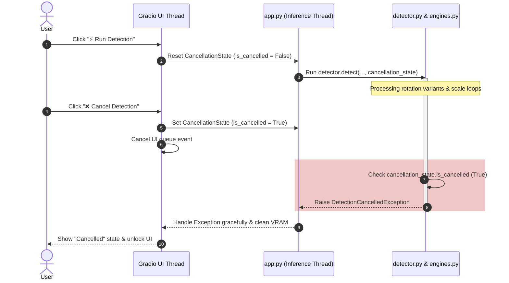
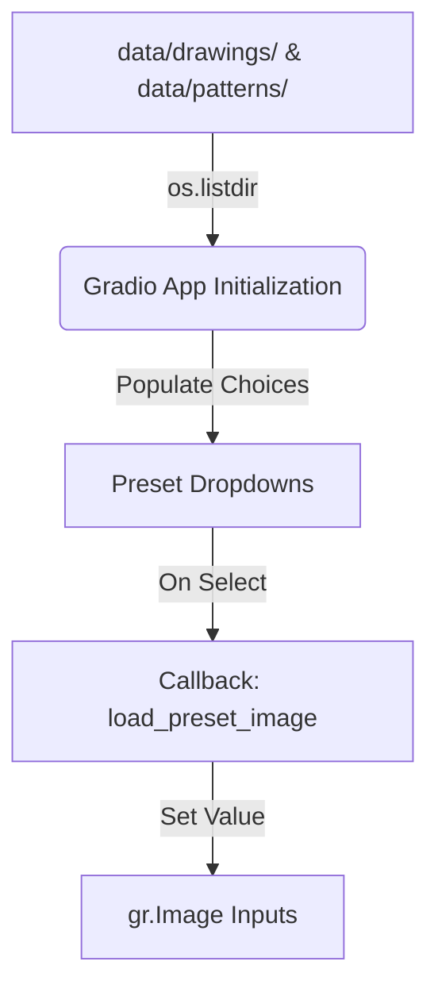

# Design Spec: BOM Pattern Detection Enhancements and Deployment

This design document outlines the implementation plan for the final 20% of the Zero-Shot BOM Pattern Detection System. It includes the deep cancellation handling, the dynamically loaded preset drawing/pattern libraries in the UI, the HuggingFace Spaces deployment structure, and the project specification document layout.

---

## 1. System Design & Core Architectural Changes

### 1.1. Core Cancellation Mechanism
To allow users to abort a running detection process immediately (without waiting for it to complete or freezing/restarting the backend server), we implement a double-safe cancellation pattern.

1. **Gradio UI Event-Level Cancellation**: Native Gradio `.click(..., cancels=[event])` cancels the web request queue and makes the interface responsive immediately.
2. **Engine-Level Cooperative Interruption**: Since synchronous CPU/GPU operations (OpenCV template matching, deep learning inference) block the Python GIL and continue running even if the client disconnects, we pass a shared thread-safe `CancellationState` down into all heavy compute loops.



#### Class Definitions
Added to `src/exceptions.py`:
```python
class DetectionCancelledException(BOMDetectorException):
    """Ngoại lệ ném ra khi người dùng huỷ quá trình phát hiện."""
    pass
```

In `src/exceptions.py` or `src/detector.py`:
```python
class CancellationState:
    def __init__(self):
        self.is_cancelled = False
        
    def cancel(self):
        self.is_cancelled = True
        
    def reset(self):
        self.is_cancelled = False
```

#### Engine Hooks
Inside `src/engines.py` -> `multiscale_template_match`:
```python
def multiscale_template_match(
    drawing_gray: np.ndarray,
    template_preprocessed: np.ndarray,
    scale_range: Tuple[float, float] = (0.5, 1.5),
    scale_step: float = 0.05,
    threshold: float = 0.50,
    cancellation_state: Any = None,  # Added parameter
) -> List[Tuple[int, int, int, int, float, float]]:
    ...
    for scale in scales:
        if cancellation_state and cancellation_state.is_cancelled:
            raise DetectionCancelledException("Detection process aborted by user.")
        ...
```

Inside `src/detector.py` -> `detect`:
```python
    def detect(
        self,
        mode: str = "v3",
        ...,
        cancellation_state: Any = None,  # Added parameter
    ) -> Tuple[List[Dict[str, Any]], Dict[str, Any]]:
        ...
        for idx, (tmpl, rotation_name) in enumerate(self.templates_variants):
            if cancellation_state and cancellation_state.is_cancelled:
                raise DetectionCancelledException("Detection process aborted by user.")
            
            tmpl_sync = tmpl
            tmpl_edge = tmpl_edges[idx]
            
            if mode == "v1":
                ...
                proposals = multiscale_template_match(
                    drawing_edge, tmpl_edge, threshold=v1_threshold, cancellation_state=cancellation_state
                )
```

---

## 2. Dynamic Preset Library Integration

To allow reviewers to test the app without manual file uploads, we implement a dynamic preset selector.

1. **Auto-Discovery**: On server startup, Python scans `./data/drawings/` and `./data/patterns/` to list all image files (`.png`, `.jpg`, `.jpeg`).
2. **Gradio Binding**: Add two dropdown inputs under a dedicated `"💡 Preset Sample Library"` accordion panel.
3. **Change Handlers**: Selecting a value from a dropdown triggers a reactive callback that reads the file path and sets the value of the corresponding `gr.Image` component.



---

## 3. HuggingFace Deployment Structure

HuggingFace Spaces expect a root-level `app.py`. We will structure the project as follows:

```text
CV_BOM_Detection/
├── app.py                     # [NEW] Public Entrypoint (Runs from root, imports src.app)
├── SPECIFICATION.md           # [NEW] Comprehensive Technical Specification
├── requirements.txt           # Main dependencies list
├── src/
│   ├── app.py                 # Gradio Dashboard Implementation
│   ├── detector.py            # Main Orchestrator
│   ├── engines.py             # Matcher, Soft-NMS, Refinement
│   ├── exceptions.py          # Custom exceptions
│   └── ...
└── data/                      # Sample drawings & patterns
```

### Root-Level `app.py`
```python
import sys
import os

# Append current directory to path for absolute imports
sys.path.insert(0, os.path.dirname(os.path.abspath(__file__)))

from src.app import demo

if __name__ == "__main__":
    demo.queue().launch(
        server_name="0.0.0.0",
        server_port=7860
    )
```

Using `server_name="0.0.0.0"` is standard and necessary because Hugging Face runs applications inside Docker containers, and its reverse proxy needs to forward public web traffic to the container's bound interfaces.

---

## 4. Project Technical Specification Structure

The `SPECIFICATION.md` will contain the following key components:

1. **Problem Analysis (Phân tích bài toán)**: Features of CAD/BOM high-resolution sheets, sparsity, fine lines, high scale/rotation variance, and empty space noise.
2. **Approach Rationale & Comparison (Tư duy tiếp cận & So sánh phương pháp)**: Detailed side-by-side comparison of **V1 (Classical CV)** vs. **V2 (Deep Learning)** vs. **V3 (Hybrid Coarse-to-Fine)** showing why V3 is the optimal balance of speed, RAM protection, and semantic accuracy.
3. **System Architecture Diagrams (Sơ đồ kiến trúc & Các luồng chạy hệ thống)**:
   - System Overview Pipeline
   - Registration Flow (Polartiy, Rotation Caching)
   - Inference Flow (Dilated Edge, Proposal Generation, Coarse NMS, Batch CNN, Fusion, Soft-NMS, Refinement)
   - Cancellation Control Flow (Cross-thread flag communication)
4. **Detailed Module Explanations**: Preprocessing (Polarity Sync, Dilated Edge Maps), Feature Extraction (Shared Extractor, Caching, Fallbacks), Matching & Scoring (NCC, Cosine, Fusion), Post-processing (Soft-NMS, Local search refinement).
5. **Pros & Cons Evaluation**: Strengths (efficiency, zero-shot, speed) and weaknesses.
6. **Current Limitations & Future Enhancements**: Addressing extremely distorted, low-contrast, or handwritten symbols.
7. **Benchmark Framework Structure**: Ready-to-use template for inserting test case results.
